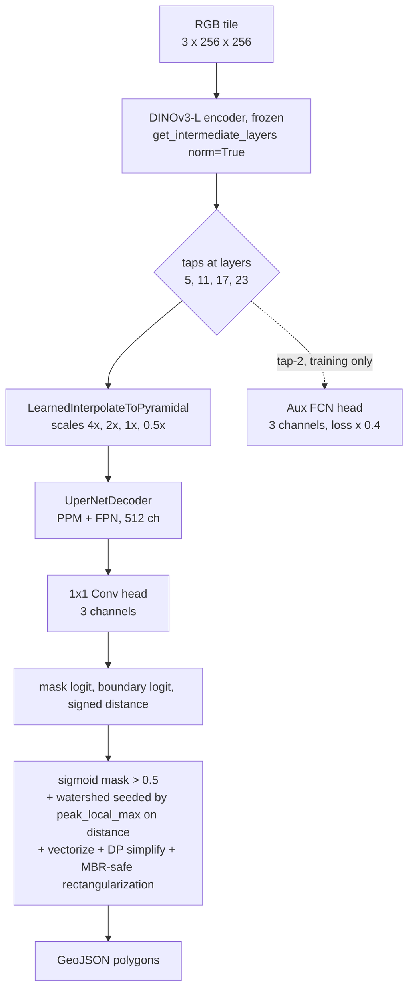

# dinov3-hot

Binary building footprint segmentation from VHR RGB aerial imagery, built on a frozen DINOv3-ViT-L/16 (LVD1689M) encoder with a UperNet decoder, multi-task auxiliary heads, and watershed instance separation. Trained on the global [hotosm/vhr-building-segmentation](https://huggingface.co/datasets/hotosm/vhr-building-segmentation) dataset; ships to [hotosm/fAIr-models](https://github.com/hotosm/fAIr-models) as a portable ONNX model.

## Approach

The encoder stays frozen. We learn a UperNet decoder on top of it, plus three small task-specific heads that share supervision signal:

| Head | Output | Why it exists |
| --- | --- | --- |
| Mask | `sigmoid` of channel 0 | The thing we ship: is this pixel a building? |
| Boundary | `sigmoid` of channel 1 | A 2-pixel ring around each building polygon; sharpens edges where buildings touch. |
| Distance | `tanh` of channel 2 | Signed distance to the nearest boundary, clipped to +/-15 px and normalized to [-1, 1]. Provides watershed seeds at inference. |

An auxiliary FCN head taps the third encoder layer's features and predicts the same three channels with loss weight 0.4. It is supervision-only and is dropped at inference time.



At inference time, the predicted mask + distance map go through a watershed pass: local maxima of the distance map become per-building seeds, watershed assigns each pixel to its nearest seed, and the result is vectorized. A two-step regularizer then runs in metric space: Douglas-Peucker simplifies each polygon's vertex set, and any near-rectangular polygon is replaced by its minimum rotated rectangle when the substitution does not introduce more than a small tolerance of new overlap with neighbours. The thresholds for both steps are configurable in [`conf/train.yaml`](conf/train.yaml).

The recipe follows Meta's reference UperNet recipe for DINOv3 ([github issue #54](https://github.com/facebookresearch/dinov3/issues/54)) with two project-specific additions: the boundary + distance heads, and the watershed post-process.

## Loss

The training objective is a weighted sum of four terms applied to the main head's three output channels, plus the same combination applied to the auxiliary head's outputs at weight 0.4:

```text
loss = BCE(mask)
     + Dice(mask)
     + alpha * BCE(boundary)
     + beta  * Huber(distance, delta=1.0)
     + gamma * TV(sigmoid(mask))
     + 0.4 * <same combination on aux head>
```

The weights `alpha`, `beta`, `gamma` are found by Optuna TPE hyperparameter search. The TV term (`kornia.losses.total_variation`) penalizes pixel-to-pixel jaggedness on the mask probability; HPO can pick zero if it doesn't help.

The shipped checkpoint uses the params in [`conf/experiments/v5_hpo_best.yaml`](conf/experiments/v5_hpo_best.yaml): `alpha=0.27`, `beta=0.47`, `gamma=0.049`, `aux_loss_weight=0.22`.

## Metrics

We report three families, all implemented in [`src/dinov3_hot/metrics.py`](src/dinov3_hot/metrics.py):

### Pixel IoU (binary Jaccard)

`torchmetrics.classification.BinaryJaccardIndex` aggregated across all evaluation pixels. Standard intersection-over-union on the binary mask. Tells us "what fraction of foreground pixels did we correctly predict?". This is what we monitor during training (`val/iou`) and report on the HF test split (`test/iou`).

Pixel IoU is the right metric when "is this pixel a building" is the question. It does not say anything about whether neighboring buildings got separated or merged.

### Instance F1 @ IoU > 0.5

The harmonic mean of instance precision and recall, where each predicted polygon is matched to at most one ground-truth polygon by Hungarian matching with pixel-IoU > 0.5 as the assignment criterion. Implemented in [`src/dinov3_hot/metrics.py`](src/dinov3_hot/metrics.py) on top of `torchmetrics.detection.PanopticQuality` (which already does this matching) with a thin wrapper that exposes precision and recall separately.

This is **not** mAP. mAP integrates precision-recall across confidence thresholds and is used for object detection benchmarks like COCO. Instance F1 at a fixed IoU threshold is the standard metric in the cell-segmentation and building-footprint literature (stardist, Cellpose, SpaceNet) because the question is "did we recover each building as its own polygon?", not "rank these polygons by confidence".

For dense urban building segmentation, **instance F1 is the metric that matche our intent**. Pixel IoU can stay high while instance F1 collapses if the model merges touching buildings into single blobs.

### Polygon shape (avg vertices, edge orthogonality)

Pixel and instance metrics say nothing about how cartographically usable the output polygons are. Two shape statistics on the predicted polygons capture that:

- **avg vertices**: mean number of unique exterior vertices per polygon (`polygon_vertex_count`). OSM building polygons in dense urban scenes average ~5; a polygon traced from a raw rasterised mask can have 15+ from stairstep edges. Lower is closer to GT.
- **edge orthogonality**: mean fraction of polygon edges aligned (within 5°) to the polygon's dominant axis, where dominant axis is the orientation of its minimum rotated rectangle (`polygon_orthogonality`). 1.0 means every edge is parallel or perpendicular to that axis (rectangular); ~0.3 means no preferred direction (jagged / free-form).

We report all three families together:

- **Pixel IoU**: how much of the building area was found.
- **Instance F1**: how often individual buildings were recovered as distinct polygons.
- **avg vertices / orthogonality**: how cartographically clean the polygons are.

## Results

All numbers reproducible against pinned data revisions:

- **HF training/test dataset (standard benchmark)**: [`hotosm/vhr-building-segmentation@8d3e64e5`](https://huggingface.co/datasets/hotosm/vhr-building-segmentation/tree/8d3e64e5c69aa37209953cce3a48df1092bc7c94) (snapshot 2026-05-08).
- **fAIr-models sample (per-area validation only)**: [`hotosm/fAIr-models@9f8a7b69`](https://github.com/hotosm/fAIr-models/tree/9f8a7b6987a86bdb01dd9539499678b6566ac6bf/data) (`data/sample.zip`).

### HF global test split (7236 tiles, standard benchmark)

Per-tile inference on the held-out test split. Pixel IoU and instance F1 aggregate TP/FP/FN across all tiles. Each tile carries WGS84 `bbox_*` fields, so its rasterio transform is derived per-tile (no hardcoded pixel scale), and polygon shape stats are computed in each tile's local UTM zone (via `gpd.GeoDataFrame.estimate_utm_crs`).

| | Pixel IoU | Precision | Recall | F1@0.5 | avg v | orth |
| --- | ---: | ---: | ---: | ---: | ---: | ---: |
| **v5 (shipped)** | **0.441** | 0.212 | 0.345 | **0.262** | **4.91** | **0.71** |
| GT (HF mask polygons, for reference) | 1.000 | 1.000 | 1.000 | 1.000 | 4.30 | 0.91 |

The HF test set is a heterogeneous global sample, so absolute pixel IoU and instance F1 are lower than on any single curated AOI. Predicted polygons average ~14% more vertices than GT (4.91 vs 4.30) and are 78% as axis-aligned (0.71 vs 0.91), which is the cartographic gap the regularize step is meant to close.

Reproduce with [`scripts/eval_hf_test.py`](scripts/eval_hf_test.py):

```bash
uv run python scripts/eval_hf_test.py --ckpt outputs/dinov3l_v5/ckpts/<your-best>.ckpt
```

### Banepa, Nepal (per-area validation)

A single dense urban AOI used to spot-check behaviour on a known area. The fAIr-models repository ships a published train/test chip split: train is the western half of the AOI (120 chips, 4239 OSM polygons), test is the eastern half (36 chips, 2720 polygons), geographically disjoint. The test chips are stitched into a 1536 × 1536 GeoTIFF at z=18 OAM (~0.6 m/pixel) and run through the production `dinov3-hot predict` sliding-window CLI, matching how fAIr will invoke the shipped ONNX in deployment.

| | Pixel IoU | Precision | Recall | F1@0.5 | avg v | orth |
| --- | ---: | ---: | ---: | ---: | ---: | ---: |
| **v5 (shipped)** | **0.656** | 0.483 | 0.351 | **0.407** | **5.99** | **0.63** |
| GT (OSM, for reference) | 1.000 | 1.000 | 1.000 | 1.000 | 5.30 | 0.95 |

Reproduce with [`scripts/eval_banepa.py`](scripts/eval_banepa.py) (wraps `predict_geotiff` + the canonical metrics):

```bash
uv run python scripts/eval_banepa.py \
  --ckpt outputs/dinov3l_v5/ckpts/<your-best>.ckpt \
  --raster path/to/banepa_merged.tif \
  --gt path/to/osm_ground_truth.geojson
```

Per-chip ablations (zero-shot and per-area-finetuned) are in [`scripts/eval_fair_sample.py`](scripts/eval_fair_sample.py); that surface bypasses the production sliding-window CLI and is not reported in the table.

## Layout

```text
src/dinov3_hot/        # Python package: model, data, train, infer, finetune, hpo, export, eval, metrics
conf/                  # YAML configs
conf/experiments/      # tracked snapshots of HPO-found params per release
scripts/               # one-off analysis scripts (Banepa eval, geometry viz)
tests/                 # pytest suite
outputs/               # local run artifacts (gitignored)
pr_pack/               # fAIr-models drop (gitignored; staged locally, push to fAIr-models repo)
```

## Usage

```bash
# install
just setup

# train at 100% data with HPO
uv run dinov3-hot train --config conf/train.yaml

# train with HPO disabled (uses fixed cfg values)
uv run dinov3-hot train --config conf/train.yaml hpo.enabled=false

# sliding-window inference on a GeoTIFF
uv run dinov3-hot predict --ckpt outputs/dinov3l_v5/ckpts/best-05-0.5809.ckpt \
  --raster path/to/raster.tif --out path/to/predictions.geojson

# per-area decoder finetune on a small chip set
uv run dinov3-hot finetune --ckpt <path> --chips-dir <path> \
  --labels-geojson <path> --out-dir <path>

# export to ONNX for fAIr-models deployment
uv run dinov3-hot export --ckpt <path> --out pr_pack/dinov3_buildings/artifacts/dinov3_buildings.onnx
```

## Stack

- Python 3.13, `uv` package manager
- PyTorch 2.7, PyTorch Lightning 2.6
- `terratorch` for the UperNet decoder and `LearnedInterpolateToPyramidal` neck
- `torchmetrics` for IoU and PanopticQuality-based instance matching
- `optuna` for HPO
- `rasterio`, `geopandas`, `shapely`, `skimage`, `scipy` for geospatial I/O and post-processing
- `kornia` for total-variation loss
- `segmentation_models_pytorch` for Dice loss
- `huggingface_hub` and `datasets` for backbone weights and training data

## License

Apache-2.0. DINOv3-L encoder weights from Facebook Research, Apache-2.0.
