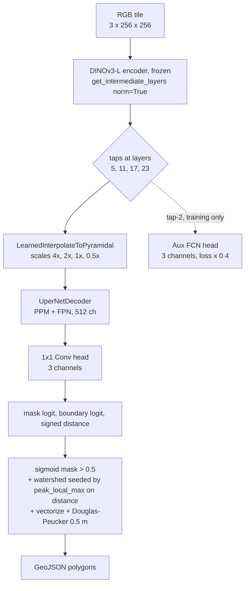

# dinov3-hot

Binary building footprint segmentation from VHR RGB aerial imagery, built on a frozen DINOv3-ViT-L/16 (LVD1689M) encoder with a UperNet decoder, multi-task auxiliary heads, and watershed instance separation. Trained on the global [hotosm/vhr-building-segmentation](https://huggingface.co/datasets/hotosm/vhr-building-segmentation) dataset; ships to [hotosm/fAIr-models](https://github.com/hotosm/fAIr-models) as a portable ONNX model.

## Approach

The encoder stays frozen. We learn a UperNet decoder on top of it, plus three small task-specific heads that share supervision signal:

| Head | Output | Why it exists |
| --- | --- | --- |
| Mask | `sigmoid` of channel 0 | The thing we ship: is this pixel a building? |
| Boundary | `sigmoid` of channel 1 | A 2-pixel ring around each building polygon; sharpens edges where buildings touch. |
| Distance | `tanh` of channel 2 | Signed distance to the nearest boundary, clipped to +/-15 px and normalized to [-1, 1]. Provides watershed seeds at inference. |

An auxiliary FCN head taps the third encoder layer's features and predicts the same three channels with loss weight 0.4. It is supervision-only and is dropped at inference time.



At inference time, the predicted mask + distance map go through a watershed pass: local maxima of the distance map become per-building seeds, watershed assigns each pixel to its nearest seed, and the result is vectorized with Douglas-Peucker simplification at 0.5 m. This produces clean, instance-separated polygons in dense urban scenes where naive connected components would merge neighboring buildings.

The recipe follows Meta's reference UperNet recipe for DINOv3 ([github issue #54](https://github.com/facebookresearch/dinov3/issues/54)) with two project-specific additions: the boundary + distance heads, and the watershed post-process.

## Loss

The training objective is a weighted sum of four terms applied to the main head's three output channels, plus the same combination applied to the auxiliary head's outputs at weight 0.4:

```text
loss = BCE(mask)
     + Dice(mask)
     + alpha * BCE(boundary)
     + beta  * Huber(distance, delta=1.0)
     + gamma * TV(sigmoid(mask))
     + 0.4 * <same combination on aux head>
```

The weights `alpha`, `beta`, `gamma` are found by Optuna TPE hyperparameter search. The TV term (`kornia.losses.total_variation`) penalizes pixel-to-pixel jaggedness on the mask probability; HPO can pick zero if it doesn't help.

The shipped checkpoint uses the params in [`conf/experiments/v5_hpo_best.yaml`](conf/experiments/v5_hpo_best.yaml): `alpha=0.27`, `beta=0.47`, `gamma=0.049`, `aux_loss_weight=0.22`.

## Metrics

Two distinct metrics, both reported separately:

### Pixel IoU (binary Jaccard)

`torchmetrics.classification.BinaryJaccardIndex` aggregated across all evaluation pixels. Standard intersection-over-union on the binary mask. Tells us "what fraction of foreground pixels did we correctly predict?". This is what we monitor during training (`val/iou`) and report on the HF test split (`test/iou`).

Pixel IoU is the right metric when "is this pixel a building" is the question. It does not say anything about whether neighboring buildings got separated or merged.

### Instance F1 @ IoU > 0.5

The harmonic mean of instance precision and recall, where each predicted polygon is matched to at most one ground-truth polygon by Hungarian matching with pixel-IoU > 0.5 as the assignment criterion. Implemented in [`src/dinov3_hot/metrics.py`](src/dinov3_hot/metrics.py) on top of `torchmetrics.detection.PanopticQuality` (which already does this matching) with a thin wrapper that exposes precision and recall separately.

This is **not** mAP. mAP integrates precision-recall across confidence thresholds and is used for object detection benchmarks like COCO. Instance F1 at a fixed IoU threshold is the standard metric in the cell-segmentation and building-footprint literature (stardist, Cellpose, SpaceNet) because the question is "did we recover each building as its own polygon?", not "rank these polygons by confidence".

For dense urban building segmentation, **instance F1 is the metric that matche our intent**. Pixel IoU can stay high while instance F1 collapses if the model merges touching buildings into single blobs.

We report both:

- **Pixel IoU**: how much of the building area was found.
- **Instance F1**: how often individual buildings were recovered as distinct polygons.

## Results

All numbers below are reproducible against pinned data revisions:

- **fAIr-models sample data**: [`hotosm/fAIr-models@9f8a7b69`](https://github.com/hotosm/fAIr-models/tree/9f8a7b6987a86bdb01dd9539499678b6566ac6bf/data) (`data/sample.zip`).
- **HF training/test dataset**: [`hotosm/vhr-building-segmentation@8d3e64e5`](https://huggingface.co/datasets/hotosm/vhr-building-segmentation/tree/8d3e64e5c69aa37209953cce3a48df1092bc7c94) (snapshot 2026-05-08).

### Banepa, Nepal (fAIr-models sample)

The fAIr-models repository ships a Banepa AOI sample with a published train/test chip split: train is the western half of the AOI (120 chips, 4239 OSM polygons), test is the eastern half (36 chips, 2720 polygons). The two splits are geographically disjoint, so a model trained on the train chips never sees the pixels under the test chips. Both label files (`train/osm/labels.geojson`, `test/osm/labels.geojson`) are official fAIr-models artifacts from the pinned commit above.

Three eval surfaces on the same data, each scoring against the same OSM ground truth:

| Eval surface | Pixel IoU | Precision | Recall | Instance F1@0.5 |
| --- | ---: | ---: | ---: | ---: |
| Per-chip, zero-shot, train chips (sanity, seen domain) | 0.646 | 0.380 | 0.531 | 0.443 |
| **Per-chip, zero-shot, test chips (held out, matches fAIr inference contract)** | **0.655** | **0.282** | **0.416** | **0.336** |
| Per-chip, +FT on train chips, test chips (held out) | 0.661 | 0.302 | 0.422 | 0.352 |
| Full-raster sliding-window on stitched test scene (matches `dinov3-hot predict` CLI) | 0.667 | 0.493 | 0.360 | 0.416 |

The base model, never trained on Banepa, reaches **pixel IoU 0.655 and instance F1 0.336 on the held-out per-chip test set**. Fine-tuning on the 120 train chips lifts test F1 by +1.6 pp (0.336 -> 0.352); the lift is small because the global HF pretraining already produces strong Banepa features.

Full-raster sliding-window inference over the same test pixels (stitched into a 1536 x 1536 scene at z=18 OAM, ~0.6 m/pixel) reports instance F1 0.416. The gap from the per-chip number (0.336) is the result of reconstructing polygons that straddle chip boundaries.

### HF global test split (7236 tiles)

| Metric | v5 |
| --- | ---: |
| Pixel IoU | **0.441** |
| Precision | 0.212 |
| Recall | 0.345 |
| Instance F1@0.5 | **0.262** |

The HF test set is a heterogeneous global sample; 

## Layout

```text
src/dinov3_hot/        # Python package: model, data, train, infer, finetune, hpo, export, eval, metrics
conf/                  # YAML configs
conf/experiments/      # tracked snapshots of HPO-found params per release
scripts/               # one-off analysis scripts (Banepa eval, geometry viz)
tests/                 # pytest suite
outputs/               # local run artifacts (gitignored)
pr_pack/               # fAIr-models drop (gitignored; staged locally, push to fAIr-models repo)
```

## Usage

```bash
# install
just setup

# train at 100% data with HPO
uv run dinov3-hot train --config conf/train.yaml

# train with HPO disabled (uses fixed cfg values)
uv run dinov3-hot train --config conf/train.yaml hpo.enabled=false

# sliding-window inference on a GeoTIFF
uv run dinov3-hot predict --ckpt outputs/dinov3l_v5/ckpts/best-05-0.5809.ckpt \
  --raster path/to/raster.tif --out path/to/predictions.geojson

# per-area decoder finetune on a small chip set
uv run dinov3-hot finetune --ckpt <path> --chips-dir <path> \
  --labels-geojson <path> --out-dir <path>

# export to ONNX for fAIr-models deployment
uv run dinov3-hot export --ckpt <path> --out pr_pack/dinov3_buildings/artifacts/dinov3_buildings.onnx
```

## Stack

- Python 3.13, `uv` package manager
- PyTorch 2.7, PyTorch Lightning 2.6
- `terratorch` for the UperNet decoder and `LearnedInterpolateToPyramidal` neck
- `torchmetrics` for IoU and PanopticQuality-based instance matching
- `optuna` for HPO
- `rasterio`, `geopandas`, `shapely`, `skimage`, `scipy` for geospatial I/O and post-processing
- `kornia` for total-variation loss
- `segmentation_models_pytorch` for Dice loss
- `huggingface_hub` and `datasets` for backbone weights and training data

## License

Apache-2.0. DINOv3-L encoder weights from Facebook Research, Apache-2.0.
